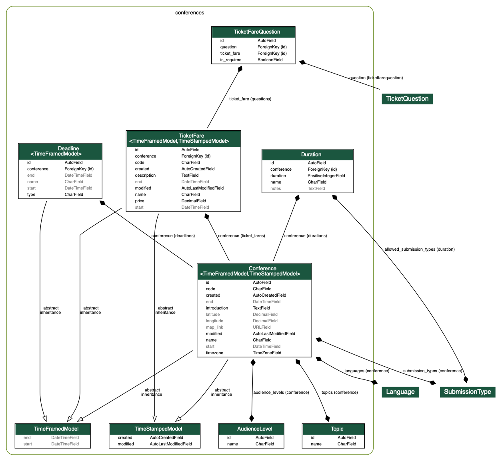
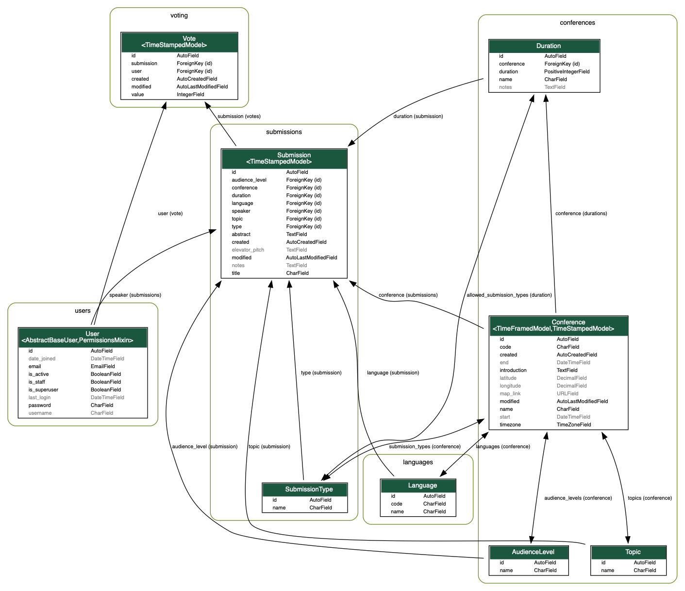

# [Conferences](https://github.com/pythonitalia/pycon/tree/master/backend/conferences)
The Conference structure is designed to be generic to allow its use both to organise a conference like PyCon or a simple Meetup.

## [Deadline](https://github.com/pythonitalia/pycon/blob/master/backend/conferences/models/deadline.py)

Deadlines are important moments of a conference. A conference can have one or more deadlines [see [deadline model](https://github.com/pythonitalia/pycon/blob/master/backend/conferences/models/deadline.py)].  Can be created <em>'milestones' deadlines</em>, like CFP (Call for proposal), voting opening, ticket refunds or others, and <em>'custom' deadlines</em>, i.e. things to show on the web page, but that doesn't have any meaning for the backend. Note that <em>Only 'milestones' deadlines are used in the code</em> by methods defined in the conference model (e.g. [`is_cfp_open`](https://github.com/pythonitalia/pycon/blob/20fdf584b255b5ddf0a9f3dcb3c4f92da356fb02/backend/conferences/models/conference.py#L38)) to understand if the user can do an action or not.

Example:
The user can send submissions <em>only if</em> the CFP is open! To understand if the CFP is open we look for a deadline of type CFP and, if it exists, we check that current date is between the beginning and the end ([`is_cfp_open`](https://github.com/pythonitalia/pycon/blob/20fdf584b255b5ddf0a9f3dcb3c4f92da356fb02/backend/conferences/models/conference.py#L38)). If the deadline does not exists, suppose it is not allowed/opened.

## [Audience Level](https://github.com/pythonitalia/pycon/blob/master/backend/conferences/models/audience_level.py)
Represents the kind of audience you expect from a submission

Example: Beginner, Intermediate, Advanced.

## Duration
It represents how long a Submission can last. Each duration has a list of SubmissionTypes that accepts ([`allowed_submission_types`](https://github.com/pythonitalia/pycon/blob/20fdf584b255b5ddf0a9f3dcb3c4f92da356fb02/backend/conferences/models/duration.py#L19)).

Example: a duration of 45 minutes can only accept Submission of type 'Talk' (and not workshops...).

## [Topic](https://github.com/pythonitalia/pycon/blob/master/backend/conferences/models/topic.py)
Is the topic of a submission.

Example: PyData, PyWeb, Python & Friends and so on.

## [Ticket Fare](https://github.com/pythonitalia/pycon/blob/master/backend/conferences/models/ticket_fare.py)
The conference ticket itself. It has a description of the ticket, a name, the price and a code that can be used to identify the type of ticket.

Example: we can use as code for the regular tickets `regularp` `regularc` `regulars` to indicate (regular `personal`, `company` and `students`) allowing the frontend to do cool things!

## [Ticket Fare Question](https://github.com/pythonitalia/pycon/blob/master/backend/conferences/models/ticket_fare_question.py)
Are questions that are needed for the organisation of the conference to which every user that has a ticket must (or should) respond.

Example: the size of the t-shirt, Eating preferences, a custom tagline to print in the Ticket.

## Class Diagram

# [Submission](https://github.com/pythonitalia/pycon/blob/eddd65bc7f695e25ae28e8ce19a2ea08b818de99/backend/submissions/models.py#L9)
When the call for proposal is open every users can send a submission . He must specify (together with the title, abstract, topic and other information) the type of submission he wants to propose. It should be one of the SubmissionsType admitted by the conference could be for example a `Talk`, a `Workshop`, a `Sprint`. Also the Duration of the submission should be one of the duration admitted by the conference.

# [Voting](https://github.com/pythonitalia/pycon/blob/eddd65bc7f695e25ae28e8ce19a2ea08b818de99/backend/voting/models.py#L8)
When the voting deadline is open any user who has a ticket can indicate his personal interest in attending to each submission arrived during the CFP.
To understand if the voting is open, as we do for CFP, there is the [`is_voting_open`](https://github.com/pythonitalia/pycon/blob/eddd65bc7f695e25ae28e8ce19a2ea08b818de99/backend/conferences/models/conference.py#L43) method defined in the conference model.

For each submission the user has 4 four choices _"not_interested"_, _"maybe"_, _"want_to_see"_ and _"must_see"_. After the talk voting phase, the votes will be used to select the talks and build a schedule.

## Class Diagram

